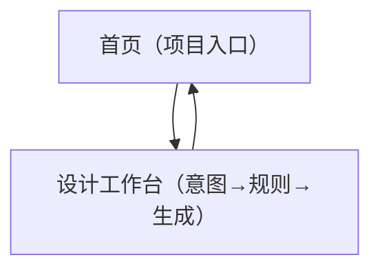

## 1. Product Overview
面向信息类设计产物（如信息图、海报、PPT 单页等）的“元设计驱动”生成式协作原型。  
你先显式定义设计意图与生成规则/约束，再由 GenAI 按规则生成，并支持你持续调规则以逼近期望输出。

## 2. Core Features

### 2.1 User Roles
| 角色 | 注册方式 | 核心权限 |
|------|----------|----------|
| 设计师（单用户原型） | 无（本地/匿名会话） | 创建项目；编辑意图与规则；触发生成；查看与导出生成结果 |

### 2.2 Feature Module
本原型需求由以下最少页面构成：
1. **首页（项目入口）**：项目列表、创建/打开项目、快速继续上次编辑。
2. **设计工作台（意图→规则→生成）**：设计意图编辑、规则/约束编辑、生成触发与参数、结果预览与导出。

### 2.3 Page Details
| Page Name | Module Name | Feature description |
|-----------|-------------|---------------------|
| 首页（项目入口） | 项目列表 | 展示已有项目（名称、更新时间）；支持打开项目进入工作台 |
| 首页（项目入口） | 创建项目 | 输入项目名称与产物类型（信息图/海报/PPT 单页/社媒物料/宣传物料）；创建后进入工作台 |
| 首页（项目入口） | 最近项目 | 一键继续最近编辑的项目 |
| 设计工作台（意图→规则→生成） | 产物类型与目标 | 显示/切换当前项目产物类型；填写目标与受众/场景一句话描述（用于约束生成） |
| 设计工作台（意图→规则→生成） | 设计意图编辑 | 编辑信息内容要点与结构层级（例如标题/要点/结论的层级）；支持保存 |
| 设计工作台（意图→规则→生成） | 生成规则与约束 | 编辑可读的规则/约束（结构、布局倾向、视觉风格关键词、禁用项等）；支持保存 |
| 设计工作台（意图→规则→生成） | 生成与迭代 | 点击生成；在同一页面继续调整“意图/规则/约束”并再次生成，以减少反复试错成本 |
| 设计工作台（意图→规则→生成） | 结果预览 | 展示生成结果（至少一种可预览形式，如图片或结构化版式预览）；支持在生成前后对照查看当前输入 |
| 设计工作台（意图→规则→生成） | 导出 | 导出生成结果（至少支持下载文件/复制结果内容之一），用于推进实际设计任务 |

## 3. Core Process

### 3.1 主流程（设计师）
1) 进入首页，创建项目并选择产物类型（如海报/PPT 单页等）。
2) 在工作台中填写“设计意图”（要表达的信息与结构层级）。
3) 在工作台中补充“生成规则与约束”（例如结构规则、视觉风格关键词、禁用项）。
4) 点击生成，让 GenAI 按规则输出结果。
5) 根据结果反馈，继续调整规则/约束或意图描述，再次生成，直到满足预期。
6) 导出结果，用于后续设计任务推进。

### 3.2 页面导航流程图

