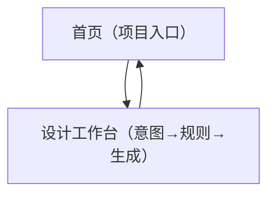

## 1. Product Overview
面向信息类设计产物（信息图、海报、PPT 单页等）的「元设计驱动」生成式协作原型。  
你先显式定义设计意图与生成规则/约束，再由 GenAI 按规则生成，并支持你持续调规则以逼近期望输出。

### 1.1 目标（Goals）
- 降低“靠反复改 Prompt 试错”的成本：把关键约束显式化、可编辑、可复用。
- 提升信息类产物的生成可控性：让输出更贴近你的目标、受众与结构层级。

### 1.2 目标用户（Users）
- 设计师/内容设计者（单用户原型）：需要快速生成信息类视觉物料的初稿/方案，并通过规则迭代提升质量。

### 1.3 范围（Scope）
**In Scope（本期必须有）**
- 项目：创建/打开项目；查看项目列表与最近项目。
- 工作台：填写产物类型与目标；编辑设计意图；编辑生成规则与约束；触发生成与多轮迭代；结果预览；导出结果。

**Out of Scope（本期不做）**
- 多人协作与权限系统（登录/团队/分享）。
- 高级版本管理（规则/生成结果的版本树与回滚）。
- 生产级排版编辑器（像素级拖拽排版与组件化编辑）。

## 2. Core Features

### 2.1 User Roles
| 角色 | 注册方式 | 核心权限 |
|------|----------|----------|
| 设计师（单用户原型） | 无（本地/匿名会话） | 创建项目；编辑意图与规则；触发生成；查看与导出生成结果 |

### 2.2 Feature Module
本原型需求由以下最少页面构成：
1. **首页（项目入口）**：项目列表、创建/打开项目、快速继续上次编辑。
2. **设计工作台（意图→规则→生成）**：设计意图编辑、规则/约束编辑、生成触发与参数、结果预览与导出。

### 2.3 用户故事（User Stories）
- 作为设计师，我想创建一个项目并选择产物类型，以便明确本次生成目标。
- 作为设计师，我想用“设计意图”写清信息要点与层级结构，以便输出内容组织更符合预期。
- 作为设计师，我想用“规则/约束”写清布局倾向、风格关键词与禁用项，以便输出更可控。
- 作为设计师，我想快速多次生成并对照输入与输出，以便用最少试错找到可用方案。
- 作为设计师，我想导出生成结果，以便推进后续实际设计制作。

### 2.4 Page Details（需求清单）
| Page Name | Module Name | Feature description |
|-----------|-------------|---------------------|
| 首页（项目入口） | 项目列表 | 展示已有项目（名称、更新时间）；支持打开项目进入工作台 |
| 首页（项目入口） | 创建项目 | 输入项目名称与产物类型（信息图/海报/PPT 单页/社媒物料/宣传物料）；创建后进入工作台 |
| 首页（项目入口） | 最近项目 | 一键继续最近编辑的项目 |
| 设计工作台（意图→规则→生成） | 产物类型与目标 | 显示/切换当前项目产物类型；填写目标与受众/场景一句话描述（用于约束生成） |
| 设计工作台（意图→规则→生成） | 设计意图编辑 | 编辑信息内容要点与结构层级（例如标题/要点/结论的层级）；支持保存 |
| 设计工作台（意图→规则→生成） | 生成规则与约束 | 编辑可读的规则/约束（结构、布局倾向、视觉风格关键词、禁用项等）；支持保存 |
| 设计工作台（意图→规则→生成） | 生成与迭代 | 点击生成；在同一页面继续调整“意图/规则/约束”并再次生成，以减少反复试错成本 |
| 设计工作台（意图→规则→生成） | 结果预览 | 展示生成结果（至少一种可预览形式，如图片或结构化版式预览）；支持在生成前后对照查看当前输入 |
| 设计工作台（意图→规则→生成） | 导出 | 导出生成结果（至少支持下载文件/复制结果内容之一），用于推进实际设计任务推进 |

## 3. Core Process

### 3.1 主流程（设计师）
1) 进入首页，创建项目并选择产物类型（如海报/PPT 单页等）。
2) 在工作台中填写“设计意图”（要表达的信息与结构层级）。
3) 在工作台中补充“生成规则与约束”（例如结构规则、视觉风格关键词、禁用项）。
4) 点击生成，让 GenAI 按规则输出结果。
5) 根据结果反馈，继续调整规则/约束或意图描述，再次生成，直到满足预期。
6) 导出结果，用于后续设计任务推进。

### 3.2 页面导航流程图

## 4. 成功指标（Success Metrics）
- 生成可控性：在 3 轮以内生成“可用初稿”的比例（由你定义“可用”标准）。
- 效率提升：完成一次从创建项目到导出结果的平均用时。
- 迭代效率：单项目平均迭代轮次与单轮迭代耗时。
- 导出转化：生成后发生导出的比例（反映“可带走用”的程度）。

## 5. 待确认问题（Open Questions）
1) “生成结果”的最小可预览形态是什么：图片、SVG、HTML/CSS、还是结构化布局 JSON？
2) “导出”本期确定支持哪些格式：下载文件、复制内容、或两者都要？
3) 产物类型（信息图/海报/PPT 单页/社媒物料/宣传物料）是否需要不同的默认规则模板？（若需要，模板从哪里来）
4) 规则/约束的表达形式：纯文本为主，还是需要结构化字段（如布局倾向、禁用项、关键词分别输入）？
5) 生成参数最小集合是什么：是否需要暴露如“生成强度/随机性”等参数，还是完全不出现？
6) “项目保存”范围：仅保存意图与规则，还是也保存每次生成的结果与输入快照？