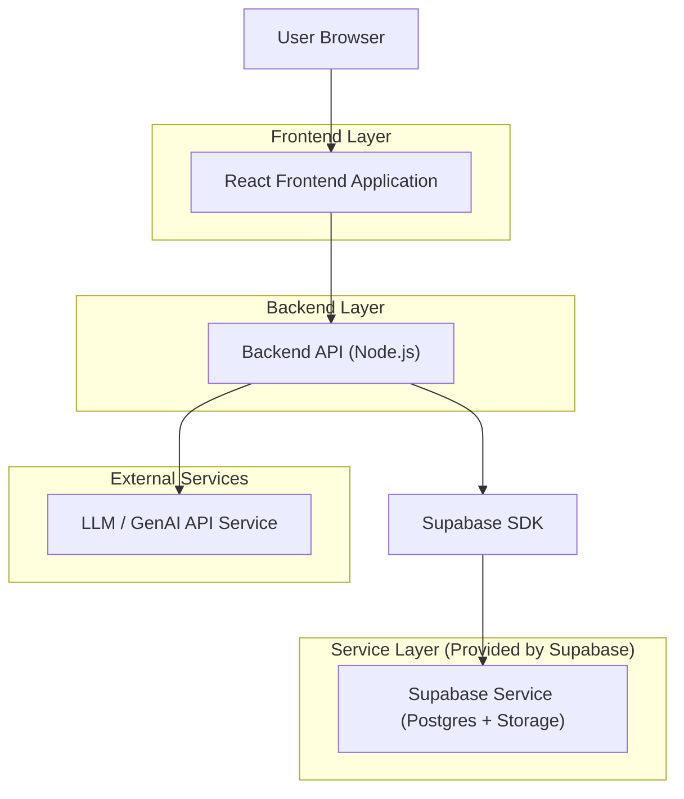
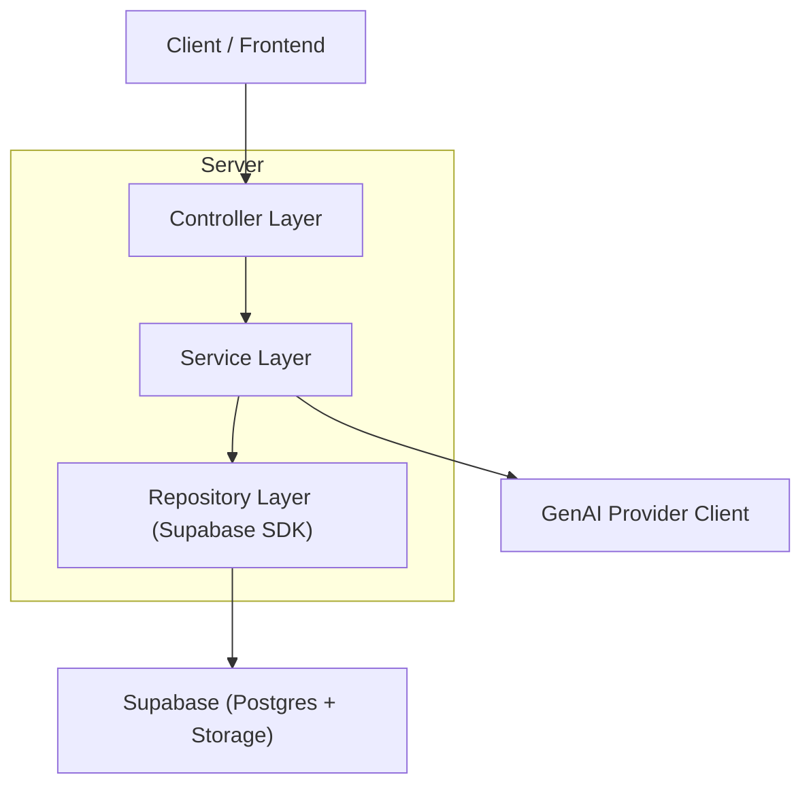
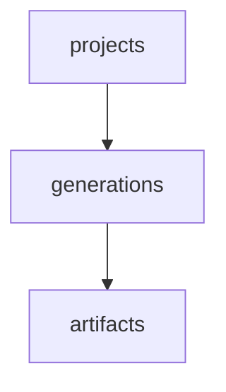

## 1.Architecture design



### 前端 / 后端边界（MVP）

* 前端（React）：

  * 信息设计项目的 UI：意图编辑、规则/约束编辑、触发生成、结果预览与导出入口。

  * 仅保存“界面态”（未保存草稿、表单校验、加载状态）。

  * 通过后端 API 获取/保存项目与生成结果，不直接持有任何 GenAI 密钥。

* 后端（Node.js API）：

  * 将“意图 + 规则/约束 + 产物类型”编译为可执行的生成请求（prompt/结构化指令）。

  * 调用外部 GenAI 服务（需要安全存放 API Key）。

  * 读写 Supabase 数据（项目、生成任务、结果元数据）与对象存储（生成产物文件）。

## 2.Technology Description

* Frontend: React\@18 + TypeScript + vite + tailwindcss\@3

* Backend: Node.js + TypeScript + Express\@4（或同级轻量框架）

* Database & Storage: Supabase (PostgreSQL + Storage)

* Auth: None（草稿阶段单用户原型；后续可接入 Supabase Auth）

## 3.Route definitions

| Route                 | Purpose                |
| --------------------- | ---------------------- |
| /                     | 首页：项目列表、创建/打开项目        |
| /workspace/:projectId | 设计工作台：意图/规则编辑、生成、预览、导出 |

## 4.API definitions

### 4.1 Core API

项目相关

* `GET /api/projects`：获取项目列表

* `POST /api/projects`：创建项目

* `GET /api/projects/:id`：获取项目详情

* `PUT /api/projects/:id`：更新项目（意图、规则、类型等）

生成相关

* `POST /api/generations`：基于项目当前意图+规则发起生成

请求（创建生成）

| Param Name | Param Type          | isRequired | Description |
| ---------- | ------------------- | ---------- | ----------- |
| projectId  | string (uuid)       | true       | 项目 ID       |
| mode       | 'draft' \| 'refine' | true       | 生成模式：初稿或迭代  |

响应（创建生成）

| Param Name   | Param Type                          | Description |
| ------------ | ----------------------------------- | ----------- |
| generationId | string (uuid)                       | 生成任务 ID     |
| status       | 'queued' \| 'succeeded' \| 'failed' | 状态          |
| artifactUrl  | string \| null                      | 产物访问地址（成功时） |
| errorMessage | string \| null                      | 错误信息（失败时）   |

### 4.2 Shared TypeScript Types（前后端共用）

```ts
export type ArtifactType =
  | 'infographic'
  | 'poster'
  | 'ppt_slide'
  | 'social_media_graphic'
  | 'marketing_collateral';

export interface Project {
  id: string;
  name: string;
  artifactType: ArtifactType;
  intentText: string; // 设计意图（信息内容与结构描述）
  rulesText: string;  // 规则/约束（结构/风格/禁用项等）
  createdAt: string;
  updatedAt: string;
}

export interface Generation {
  id: string;
  projectId: string;
  mode: 'draft' | 'refine';
  inputSnapshot: {
    intentText: string;
    rulesText: string;
    artifactType: ArtifactType;
  };
  status: 'queued' | 'succeeded' | 'failed';
  artifactUrl: string | null;
  errorMessage: string | null;
  createdAt: string;
}
```

## 5.Server architecture diagram



## 6.Data model

### 6.1 Data model definition（要点）



* projects：项目主表，承载“产物类型 + 设计意图 + 规则/约束”的当前版本。

* generations：每次生成请求的记录，保存输入快照与状态，便于最小可观测与错误追踪。

* artifacts：生成产物元数据（文件路径/类型/尺寸等），实际文件放 Supabase Storage。

### 6.2 Data Definition Language

Projects Table (projects)

```sql
CREATE TABLE projects (
  id UUID PRIMARY KEY DEFAULT gen_random_uuid(),
  name TEXT NOT NULL,
  artifact_type TEXT NOT NULL,
  intent_text TEXT NOT NULL DEFAULT '',
  rules_text TEXT NOT NULL DEFAULT '',
  created_at TIMESTAMPTZ NOT NULL DEFAULT NOW(),
  updated_at TIMESTAMPTZ NOT NULL DEFAULT NOW()
);

CREATE INDEX idx_projects_updated_at ON projects(updated_at DESC);

GRANT SELECT ON projects TO anon;
GRANT ALL PRIVILEGES ON projects TO authenticated;
```

Generations Table (generations)

```sql
CREATE TABLE generations (
  id UUID PRIMARY KEY DEFAULT gen_random_uuid(),
  project_id UUID NOT NULL,
  mode TEXT NOT NULL,
  input_snapshot JSONB NOT NULL,
  status TEXT NOT NULL,
  artifact_url TEXT,
  error_message TEXT,
  created_at TIMESTAMPTZ NOT NULL DEFAULT NOW()
);

CREATE INDEX idx_generations_project_id ON generations(project_id);
CREATE INDEX idx_generations_created_at ON generations(created_at DESC);

GRANT SELECT ON generations TO anon;
GRANT ALL PRIVILEGES ON generations TO authenticated;
```

Artifacts Table (artifacts)

```sql
CREATE TABLE artifacts (
  id UUID PRIMARY KEY DEFAULT gen_random_uuid(),
  project_id UUID NOT NULL,
  generation_id UUID NOT NULL,
  storage_bucket TEXT NOT NULL,
  storage_path TEXT NOT NULL,
  mime_type TEXT,
  width INT,
  height INT,
  created_at TIMESTAMPTZ NOT NULL DEFAULT NOW()
);

CREATE INDEX idx_artifacts_project_id ON artifacts(project_id);
CREATE INDEX idx_artifacts_generation_id ON artifacts(generation_id);

GRANT SELECT ON artifacts TO anon;
GRANT ALL PRIVILEGES ON artifacts TO authenticated;
```

## 7. Directory structure（建议：可扩展最小原型）

```
meta_design/
  proposal.md
  .trae/documents/
    PRD_元设计驱动信息设计生成系统_草稿.md
    技术架构_元设计驱动信息设计生成系统_最小原型.md
  apps/
    web/                     # React 前端
      src/
        pages/
          Home/
          Workspace/
        components/
        lib/apiClient.ts     # 调用后端 API
    api/                     # Node.js 后端
      src/
        controllers/
        services/
          generationService.ts
        repositories/
          supabaseRepo.ts
        integrations/
          genaiClient.ts     # 外部 GenAI 调用封装
        types/
          shared.ts
  packages/
    shared/                  # 共享类型（可选，后续抽离）
```

### 可扩展点（不改变 MVP 核心流程）

* 引入 Supabase Auth：从“单用户原型”演进到“多用户项目空间”。

* 将 rules\_text 从纯文本升级为结构化 JSON Schema（便于更强的规则映射与可视化编辑）。

* 扩展 artifacts 支持多格式导出（PNG/SVG/PDF/JSON 结构描述等）。

