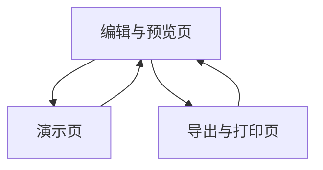

## 1. Product Overview
为“毕设中期汇报”生成一套可直接打开运行的 HTML slides（可编辑占位内容、可演示、可导出）。
面向学生/答辩者，目标是用最少页面实现结构完整、导航顺畅的中期汇报演示稿。

## 2. Core Features

### 2.1 Feature Module
本 slides 的最小可用需求由以下页面组成：
1. **编辑与预览页**：章节结构管理、内容占位编辑、实时预览、导航/快捷键提示。
2. **演示页**：全屏演示、上一页/下一页、目录跳转、进度显示。
3. **导出与打印页**：打印友好样式、导出提示与检查清单（浏览器打印/PDF）。

### 2.3 Page Details
| Page Name | Module Name | Feature description |
|-----------|-------------|---------------------|
| 编辑与预览页 | 章节结构（Outline） | 定义固定章节：封面/研究背景/相关工作/问题与目标/方法设计/实验与阶段结果/计划与风险/总结与Q&A；允许增删“子要点”而不改变主章节顺序。 |
| 编辑与预览页 | 内容占位（Placeholders） | 编辑每页标题、3–6条要点、图表/图片占位（如：图X：系统架构、流程图、实验曲线）；支持“TODO/数据待补”标记。 |
| 编辑与预览页 | 实时预览 | 在同页右侧/下方预览当前 slide；显示页码、章节名；支持点击预览跳转到对应 slide。 |
| 编辑与预览页 | 导航与快捷键提示 | 提供按钮：上一页/下一页/目录；支持键盘：←/→、PgUp/PgDn、Home/End、Esc 退出全屏。 |
| 演示页 | 演示控制 | 支持全屏切换；上一页/下一页；显示进度（如 5/18）；可隐藏/显示 UI（演示更干净）。 |
| 演示页 | 目录跳转 | 打开目录面板（列出主章节与子页）；点击跳转；当前章节高亮。 |
| 演示页 | 演讲辅助（最小） | 可选：显示“备注区”（仅在非全屏或 presenter 模式下）；不做复杂双屏同步。 |
| 导出与打印页 | 打印样式 | 提供 @media print：每页强制分页、隐藏交互控件、保证黑白可读；提示使用浏览器“打印为 PDF”。 |
| 导出与打印页 | 导出前检查 | 列出检查项：目录是否齐全、TODO 是否清零、图片是否缺失、页数是否过长；给出一键跳回编辑入口。 |

## 3. Core Process
你在编辑与预览页中按“固定章节结构”补齐要点与图片/图表占位；通过目录与快捷键快速审阅全稿。
完成后进入演示页进行全屏演示与章节跳转；需要提交时进入导出与打印页，按打印样式导出 PDF。

