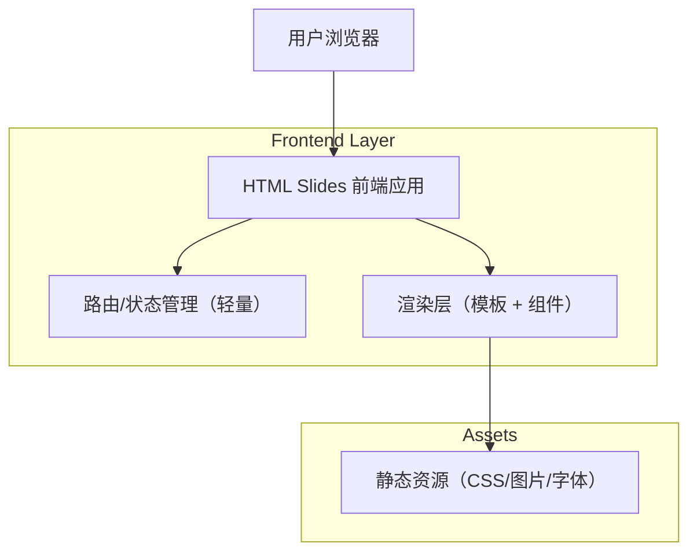

## 1.Architecture design


## 2.Technology Description
- Frontend: HTML5 + CSS3 + TypeScript（可选，亦可用原生 JS）+ Vite（本地开发/打包）
- Slides 导航（可选其一）:
  - 方案A（更省事）: Reveal.js（处理键盘导航、fragment、进度等）
  - 方案B（更可控）: 自研最小 Router + slide 容器切换（hash/History API）
- Backend: None

## 3.Route definitions
| Route | Purpose |
|-------|---------|
| / | 编辑与预览页：维护章节结构与内容占位，提供预览与跳转 |
| /present | 演示页：全屏演示、上一页/下一页、目录跳转、进度 |
| /export | 导出与打印页：打印样式说明、导出检查清单 |

## 4.API definitions (If it includes backend services)
无（纯前端静态应用）。

## 6.Data model(if applicable)
无数据库；内容以本地文件为主（例如 `slides.json` 或 `slides.ts` 常量）。

建议的数据结构（前端类型）：
```ts
export type SlideBlock =
  | { type: "bullets"; items: string[] }
  | { type: "image"; src: string; caption?: string }
  | { type: "figure"; title: string; note?: string }; // 图表占位

export type Slide = {
  id: string;
  section: string;      // 主章节名
  title: string;
  blocks: SlideBlock[];
  todo?: boolean;       // 是否含待补内容
};
```