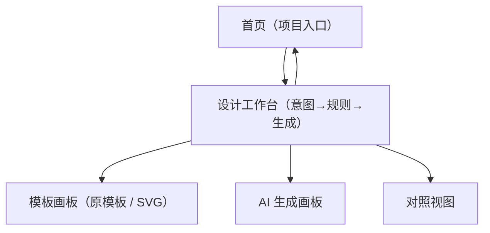

## 1. Product Overview
面向信息类设计产物（信息图、海报、PPT 单页等）的「元设计驱动」生成式协作原型。  
你先显式定义元设计空间与生成规则/约束，再由 GenAI 按规则生成，并支持你持续调规则以逼近期望输出。

### 1.1 元设计（Meta Design）定义
- 元设计关注的不是“直接产出某个设计成品”，而是把**生成设计成品的规则、约束与方法**作为一等对象来设计与管理。
- 在本原型中，元设计体现为：你以“可编辑、可复用”的方式显式写下规则/约束（结构、布局倾向、风格、禁用项等），AI 作为执行者按规则生成候选结果；你再基于结果反馈迭代规则，从而逐步收敛到更可控的输出。
- 更关键的一点是：信息设计通常可拆成**内容、结构、视觉**三个层次，而“先做哪个、后做哪个、每层 AI 介入多少/人介入多少”本身也应该是可被你定义与调整的流程资产。

### 1.2 流程资产（Flow Asset）：乐高式流程缩略图与责任方
- 在工具中提供一个“流程缩略图”区域，以乐高积木的方式展示当前项目的流程编排（内容/结构/视觉，以及必要的子步骤）。
- 每个积木块都可配置“责任方/主导者”（人主导 / 协作 / AI 主导）与介入比例，用于明确当前阶段是谁在推进、AI 介入更多还是人介入更多。
- 流程不是固定的：允许在协作过程中根据产物变化调整积木顺序（例如视觉层可以提前或滞后出现），并让流程状态随推进动态更新（当前所在层、已完成/进行中/待开始）。
- 流程编排偏向“自由拖拽节点”：你可以按需要拖入内容/结构/视觉等节点，并允许加入“低保真→高保真”的演进节点，形成可回溯的过程资产。

### 1.3 结构层（Structure Layer）的人-AI 分工（基于意图清晰度）
- 结构层的核心问题是：在已知内容原子/字段的情况下，应该如何组织信息层级与版式结构（模块划分、阅读路径、组件组合）。
- 当意图模糊时：AI 先发散。你先提出需要哪些字段与需求背景，AI 生成多份“结构草案/原型画板内容草稿（ABC）”，你挑选与合并后再转入原型画板继续编辑。
- 当意图清晰时：人来明确。你直接定义原型画板结构，AI 再据此生成执行画板；后续你可以继续迭代原型画板或直接编辑执行画板，AI 同步更新执行画板。

### 1.4 视觉层（Visual Layer）的风格资产化（长期复用 + 任务沉淀）
- 视觉层的目标是：把可迁移的风格选择与约束（品牌/校园/组织风格）从单次任务里抽出来，沉淀为可复用资产。
- 长期视觉定义（风格库）：可单独录入并纳入库（例如公司的/学校的专属风格），后续任务可一键套用。
- 单一视觉定义（任务风格）：某个任务临时定义的风格样式，可在任务结束后“纳入库”，以便后续沿用、导出与迁移。

### 1.5 目标（Goals）
- 降低“靠反复改 Prompt 试错”的成本：把关键约束显式化、可编辑、可复用。
- 提升信息类产物的生成可控性：让输出更贴近你的目标、受众与结构层级。
- 让规则成为可积累资产：同类任务可复用规则，形成个人的“生成方法库”。

### 1.6 目标用户（Users）
- 设计师/内容设计者（单用户原型）：需要快速生成信息类视觉物料的初稿/方案，并通过规则迭代提升质量。

### 1.7 范围（Scope）
**In Scope（本期必须有）**
- 项目：创建/打开项目；查看项目列表与最近项目。
- 工作台：填写产物类型与目标；编辑元设计空间；编辑生成规则与约束；触发生成与多轮迭代；结果预览；导出结果。
- 流程编排（内容/结构/视觉）：允许你自定义三层的执行顺序与“人/AI 介入比例”，并以可复用配置沉淀为方法。
- 流程缩略图（乐高积木）：展示当前流程与推进状态；支持拖拽调整顺序；支持为每层/每块配置责任方（人/协作/AI）与介入比例。
- 轻量版本管理（线性快照）：原型画板与执行画板各自保留可回看的版本序列；每次 AI 生成产生新的版本/新的画板快照，不在原画板上叠加或覆盖。
- 视觉风格库：支持长期风格与任务风格的录入、套用、导出与迁移（任务风格可一键纳入库）。
- 模板画板（原模板/元模板）：在画板中勾勒基础模板（以 SVG 为主要承载）；定义“原元素”（预置组件 + 自由绘制占位框）；为元素绑定可编辑的生成规则与约束；保存为可复用的模板资产。

**Out of Scope（本期不做）**
- 多人协作与权限系统（登录/团队/分享）。
- 高级版本管理（规则/生成结果的版本树与回滚）。
- 生产级排版编辑器（像素级拖拽排版与组件化编辑）。

## 2. Core Features

### 2.1 User Roles
| 角色 | 注册方式 | 核心权限 |
|------|----------|----------|
| 设计师（单用户原型） | 无（本地/匿名会话） | 创建项目；编辑意图与规则；触发生成；查看与导出生成结果 |

### 2.2 Feature Module
本原型需求由以下最少页面构成：
1. **首页（项目入口）**：项目列表、创建/打开项目、快速继续上次编辑。
2. **设计工作台（空间→规则→生成）**：模板画板（原模板定义）、元设计空间编辑、规则/约束编辑、生成触发与参数、结果预览与导出。
3. **受限对话助手（可内嵌在工作台）**：在元设计场景内与 AI 对话，辅助把自由想法转译为结构化规则/字段/关系约束，并能一键写入对应面板。

### 2.3 用户故事（User Stories）
- 作为设计师，我想创建一个项目并选择产物类型，以便明确本次生成目标。
- 作为设计师，我想把信息设计过程拆成内容/结构/视觉三个层次，并自定义每层的先后顺序与人/AI 介入比例，以便流程本身也能符合我的工作习惯与任务类型。
- 作为设计师，我想在工作台里看到一个乐高式的流程缩略图，并为每一层明确责任方（谁主导、谁介入更多），以便我能持续把控协作节奏。
- 作为设计师，我想在生成与讨论过程中动态调整流程（例如先做视觉再回到结构），并让缩略图自动反映当前所在阶段与推进状态。
- 作为设计师，我想在需要时与 AI 做受限对话（只围绕元设计任务），让 AI 帮我把模糊想法整理成结构化字段、正例/反例与元素关系规则，并一键落到对应的规则面板里。
- 作为设计师，当我对结构意图还很模糊时，我想让 AI 先给出多种结构草案供我挑选，以便我更快从“发散”进入“明确”。
- 作为设计师，当我对结构意图很清晰时，我想直接在原型画板里把结构确定下来，让 AI 去生成执行画板并保持同步更新。
- 作为设计师，我想维护一个可长期复用的视觉风格库（例如公司/学校专属风格），让不同任务可以直接迁移与套用。
- 作为设计师，我想在单次任务里快速定义一个任务风格，并在任务完成后把它纳入风格库，方便后续沿用、导出与迁移。
- 作为设计师，我想在模板画板里勾勒“原模板”，列出它有哪些原元素（标题/图表/图片位/要点列表等），以便我先定义结构与视觉节奏，再让 AI 在其上生成。
- 作为设计师，我想为画板中的每个元素绑定生成规则与约束（内容来源、字数范围、对齐与尺寸限制、风格关键词等），以便把“生成逻辑”从 Prompt 里抽出来，变成可复用的资产。
- 作为设计师，我想用“元设计空间”写清信息要点与层级结构，以便输出内容组织更符合预期。
- 作为设计师，我想用“规则/约束”写清布局倾向、风格关键词与禁用项，以便输出更可控。
- 作为设计师，我想用渐进式方式在多个画板间切换（模板画板/AI 生成画板/对照视图），以便我能边看生成结果边回到模板或规则处迭代，而不是在一堆文本里迷路。
- 作为设计师，我想快速多次生成并对照输入与输出，以便用最少试错找到可用方案。
- 作为设计师，我想导出生成结果，以便推进后续实际设计制作。

### 2.4 Page Details（需求清单）
| Page Name | Module Name | Feature description |
|-----------|-------------|---------------------|
| 首页（项目入口） | 项目列表 | 展示已有项目（名称、更新时间）；支持打开项目进入工作台 |
| 首页（项目入口） | 创建项目 | 输入项目名称与产物类型（信息图/海报/PPT 单页/社媒物料/宣传物料）；创建后进入工作台 |
| 首页（项目入口） | 最近项目 | 一键继续最近编辑的项目 |
| 设计工作台（意图→规则→生成） | 产物类型与目标 | 显示/切换当前项目产物类型；填写目标与受众/场景一句话描述（用于约束生成） |
| 设计工作台（意图→规则→生成） | 流程编排（内容/结构/视觉） | 配置三层的顺序（例如 内容→结构→视觉 或 结构→内容→视觉）；配置每层“人/AI 介入比例”（如手动/AI 辅助/AI 主导）；支持保存为可复用预设 |
| 设计工作台（意图→规则→生成） | 流程缩略图（乐高积木） | 在同一屏长期可见（或可展开）的流程缩略图；展示当前流程顺序与推进状态；支持拖拽重排；支持为每块设置责任方/介入比例；支持一键跳转到对应层 |
| 设计工作台（意图→规则→生成） | 受限对话助手（内嵌） | 提供与 AI 的对话入口，但对话被限定在元设计场景；支持基于当前项目上下文（产物类型、内容原子、模板、规则、风格、当前流程状态）进行提问与澄清 |
| 设计工作台（意图→规则→生成） | 对话→结构化写入 | 对话结果可被提炼为结构化配置（字段/参数、正例/反例、关系约束等）；支持“一键写入”到对应面板（内容层/结构层/规则面板/风格）并可预览差异 |
| 设计工作台（意图→规则→生成） | 对话护栏 | 限定话题范围（仅与当前项目元设计相关）；对超范围对话给出引导（建议改写为可落地的规则/字段/关系）；避免把对话变成随意闲聊 |
| 设计工作台（意图→规则→生成） | 结构层分流（意图清晰度） | 允许选择“意图清晰/意图模糊”两种结构策略；意图模糊时提供 AI 结构草案发散；意图清晰时提供人定义原型结构并驱动执行画板 |
| 设计工作台（意图→规则→生成） | AI 结构草案（发散） | 基于你提供的字段与背景，AI 生成多份结构草案（模块划分/层级/阅读路径）并可一键应用到原型画板；支持收藏与对比 |
| 设计工作台（意图→规则→生成） | 原型画板（结构定义） | 当意图清晰时，你在原型画板中明确结构与元素组织（作为执行画板的“上游”来源） |
| 设计工作台（意图→规则→生成） | 执行画板（可编辑） | AI 根据原型画板生成执行画板；你可选择继续迭代原型画板（上游修改）或直接编辑执行画板（下游修改）；AI 可在两者之间同步更新 |
| 设计工作台（意图→规则→生成） | 版本快照（不叠加生成） | 原型/执行画板提供线性版本列表（时间/标签/差异预览）；每次生成或关键编辑形成新快照，可回看与对比；禁止在同一画板上把“生成结果”叠加到既有内容里 |
| 设计工作台（意图→规则→生成） | 视觉风格库（长期定义） | 独立录入并管理可长期复用的风格（如公司/学校/组织专属风格）；支持命名、标签、搜索、套用 |
| 设计工作台（意图→规则→生成） | 任务风格（单一视觉定义） | 为当前任务快速定义风格样式（可作为默认覆盖或叠加在长期风格之上）；支持即时预览与一键套用到生成 |
| 设计工作台（意图→规则→生成） | 任务风格纳入库 | 任务完成后，将当前任务风格一键纳入风格库，形成可复用资产 |
| 设计工作台（意图→规则→生成） | 风格导出与迁移 | 支持导出风格（长期/任务）用于迁移；支持导入已导出的风格到库中 |
| 设计工作台（意图→规则→生成） | 内容层画板（原子工具） | 以“原子层出发”自由捏泥巴：提供内容原子与轻量绘制能力，用于声明本产物包含哪些内容元素与约束，作为后续结构/视觉与生成输入的一部分 |
| 设计工作台（意图→规则→生成） | 内容层原子：文字/主题 | 支持声明文本类内容：文字/主题；精确字段（如日期/数值/单位）；内容需转译（同义改写/口吻切换）；无须成文内容（仅给要点/关键词） |
| 设计工作台（意图→规则→生成） | 内容层原子：多模态 | 支持声明多模态内容：图片/视频/内嵌交互；图表；图案（icon 等可复用素材）；并可为其绑定“组件化复用”等约束 |
| 设计工作台（意图→规则→生成） | 内容层原子：简单装饰 | 支持用户定义的简单装饰元素：点/线/面；支持约束（例如不超出色块区域）用于保证装饰可控且不破坏信息层级 |
| 设计工作台（意图→规则→生成） | 模板画板（原模板 / SVG） | 在画板中勾勒基础模板（SVG）；支持预置组件与自由绘制占位框；支持基础样式（如字体/字号/色彩/风格关键词）用于约束生成 |
| 设计工作台（意图→规则→生成） | 元素与规则绑定 | 选中画板元素后，为其绑定生成规则/约束（内容来源/字数范围/尺寸与对齐/禁用项等）；规则可保存并跨项目复用 |
| 设计工作台（意图→规则→生成） | 多画板视图与对照 | 支持在“模板画板 / AI 生成画板 / 对照视图”间切换；对照时能看到模板与生成结果的对应关系，帮助定位该改哪条规则 |
| 设计工作台（意图→规则→生成） | 视图模式：自由视图 | 在大画布中自由查看多个画板与进程（内容/结构/视觉/生成结果），支持缩放/平移/快速定位当前阶段 |
| 设计工作台（意图→规则→生成） | 视图模式：双视角对照 | 聚焦“人类原意图画板 ↔ AI 生成画板”的关联对比，支持高亮对应元素/规则、显示差异与一键跳转编辑 |
| 设计工作台（意图→规则→生成） | 视图模式：单画板编辑 | 进入某个画板的专注编辑视角（原型/模板/执行任一画板），提供元素级规则编辑与属性面板，适合精细调整 |
| 设计工作台（空间→规则→生成） | 元设计空间编辑 | 编辑信息内容要点与结构层级（例如标题/要点/结论的层级）；支持保存 |
| 设计工作台（意图→规则→生成） | 生成规则与约束 | 编辑可读的规则/约束（结构、布局倾向、视觉风格关键词、禁用项等）；支持保存 |
| 设计工作台（意图→规则→生成） | 生成与迭代 | 点击生成；在同一页面继续调整“意图/规则/约束”并再次生成，以减少反复试错成本 |
| 设计工作台（意图→规则→生成） | 结果预览 | 展示生成结果（至少一种可预览形式，如图片或结构化版式预览）；支持在生成前后对照查看当前输入 |
| 设计工作台（意图→规则→生成） | 导出 | 导出生成结果（至少支持下载文件/复制结果内容之一），用于推进实际设计任务推进 |

## 3. Core Process

### 3.1 人-AI 协作流程（元设计循环）
1) 进入首页，创建项目并选择产物类型（如海报/PPT 单页等）。
2) 在工作台中配置流程编排：选择内容/结构/视觉的顺序，并设定各层的人/AI 介入比例（可保存预设）。
2.1) 在流程缩略图里确认每层责任方（人/协作/AI）与推进状态；后续可随时调整顺序并跳转到对应层。
3) 在内容层画板中用原子工具声明内容元素与约束（文字/字段/转译、多模态、图表、图案、点线面等）。
4) 进入结构层：根据你的“意图清晰度”选择结构策略。
5) 意图模糊：你提出需要的字段与需求背景，AI 生成多份结构草案（发散）；你挑选合适方案应用到原型画板，继续编辑与收敛。
6) 意图清晰：你直接在原型画板中明确结构；AI 依据原型生成执行画板。
7) 在模板画板中勾勒基础模板（SVG），放置原元素（预置组件 + 自由绘制占位框），并补充基础样式/风格约束。
8) 为关键元素绑定生成规则与约束（内容来源、字数范围、尺寸与对齐限制、禁用项等），保存为可复用的模板与规则资产。
9) 选择并套用视觉风格：从长期风格库挑选组织风格，或为本任务临时定义任务风格（可叠加/覆盖），用于约束生成的视觉表现。
10) 触发生成/同步：AI 按流程配置、内容声明、结构来源（原型/草案）、模板（SVG）、规则/约束与当前风格输出候选结果，并落到执行画板。
11) 反馈与迭代：你可以继续迭代原型画板（上游）或直接编辑执行画板（下游）；AI 同步更新执行画板，并在对照视图中帮助定位差距。
12) 导出与沉淀：导出结果；若本次形成了好用的任务风格，可一键纳入风格库，并支持导出/迁移到下一次项目。

### 3.2 页面导航流程图

## 4. 成功指标（Success Metrics）
- 生成可控性：在 3 轮以内生成“可用初稿”的比例（由你定义“可用”标准）。
- 效率提升：完成一次从创建项目到导出结果的平均用时。
- 迭代效率：单项目平均迭代轮次与单轮迭代耗时。
- 导出转化：生成后发生导出的比例（反映“可带走用”的程度）。
- 规则资产化：规则被跨项目复用的次数/比例（或复用后改动幅度）。

## 5. 待确认问题（Open Questions）

为避免问题堆叠，本节按优先级分层：

### P0（本期必须先定：影响信息架构与数据结构）
1) 生成与对齐：Web 端生成结果优先 HTML；模板画板用 SVG。HTML 与 SVG 模板元素如何对齐（元素 id/命名/结构映射）以支持对照与迭代？
2) 规则数据结构：结构化字段的最小字段集与表达（参数化约束、正例/反例、元素间关系引用）是什么？哪些字段必须支持引用（A↔B 关系）？
3) 画板映射：内容层原子与模板/原型元素如何绑定：手动绑定、AI 建议后确认，还是混合？
4) 多画板信息架构：三种视图模式（自由视图 / 双视角对照 / 单画板编辑）的切换方式、默认入口与最小能力边界。
5) 流程编排：节点式自由拖拽编排的最小交互（拖入节点、重排、责任方/介入比例设置、跳转）与是否显式支持“低保真→高保真”演进节点。
6) 原型↔执行同步与版本：上游/下游是映射关系且各自有版本序列；需要明确上游修改如何影响下游、下游直接编辑是否会生成“原型补丁”。同时明确生成策略：每次 AI 生成输出新版本/新快照，不在原画板上叠加或覆盖。

### P1（本期建议定：影响可用性与可迁移性）
1) 导出：导出支持哪些格式（SVG/PNG/代码）与最小交付体验；是否包含规则集与输入快照用于复现。
2) 风格表达：视觉风格的最小可迁移表达是 token（颜色/字体/排版）还是包含组件样式与图形语言；与模板（SVG）是否需要绑定导出。
3) 风格叠加：长期风格与任务风格的覆盖/合并策略与差异可视化方式。
4) 规则/组件复用：本期不做跨项目实时同步；需要明确哪些规则/组件允许跨项目导出迁移与最小导入/引用体验。

### P2（后续再定：优化项/增强项）
1) 结构意图清晰度：由用户手动选择，还是系统自动建议并允许切换？
2) 结构草案输出：仅模块树/层级大纲，还是可直接应用到原型画板的布局占位？
3) 流程状态自动化：流程缩略图的推进状态由手动标记，还是系统根据行为自动推断（并可修正）？
4) 生成参数：是否暴露随机性/多样性/候选数等参数。
5) 项目保存：仅保存意图/规则，还是保存每次生成的结果与输入快照。
6) 受限对话助手：最小能力边界（只做澄清 vs 可写入结构化配置）与护栏策略。
