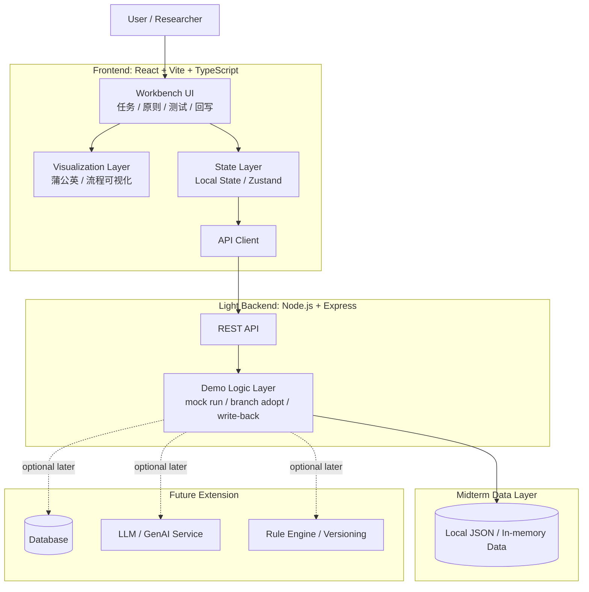
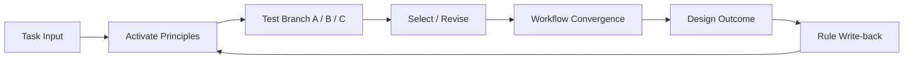
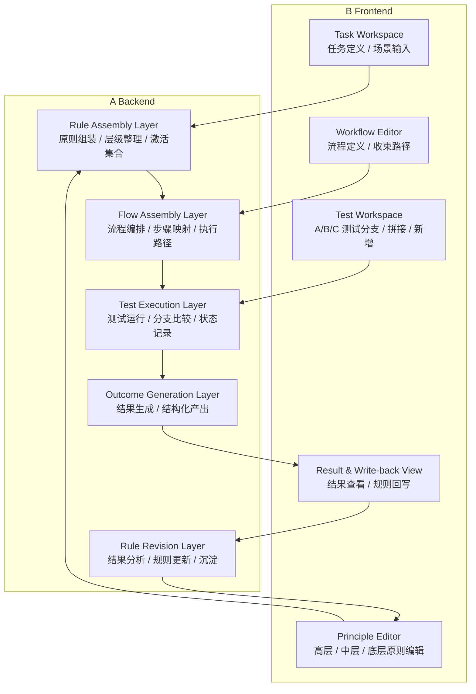

# 中期前端 Demo 技术架构

## 1. 文档定位

这份文档描述的是 `当前项目真实存在` 的技术架构，用于支持毕设中期阶段的前端 demo 继续推进。

它不是最终产品的完整技术蓝图，而是当前可运行工程的结构说明。因此，文档只记录已经存在或已经预留好的部分，不提前引入尚未接入的数据库、鉴权系统或外部 AI 服务。

<br />

## 2. 当前系统边界

当前项目可以理解为三条并行但职责不同的线：

- `中期前端 demo`
  主要用于毕设中期展示，目前承载在 `src/apps/demo` 这条线中。
- `最终产品线（WIP）`
  目前仅有一个占位入口，承载在 `src/apps/product` 中，后续会逐步放入正式原型页面与逻辑。
- `本地 API 服务`
  由 `api/` 下的 `Express` 服务提供，目前只承担最基础的接口能力与后续扩展接口的入口。

换句话说，当前工程并不是“一个已经完整打通的全栈产品”，而是：

- 前端已有成熟的 `React + Vite` 基础
- 后端已有轻量的 `Express` 服务骨架
- 中期 demo 和最终产品原型在前端结构上已经被明确分开

<br />

## 3. 当前前端架构

### 3.1 技术栈

- `React 18`
- `TypeScript`
- `Vite`
- `React Router`
- `Tailwind CSS`

### 3.2 前端入口结构

前端总入口位于 [src/App.tsx](/Users/xiaoshizi/Documents/trae_projects/meta_design/src/App.tsx)。

当前入口的核心逻辑是根据环境变量 `VITE_APP_MODE` 决定加载哪一条应用线：

- `demo` 模式：加载 [src/apps/demo/DemoApp.tsx](/Users/xiaoshizi/Documents/trae_projects/meta_design/src/apps/demo/DemoApp.tsx)
- `product` 模式：加载 [src/apps/product/ProductApp.tsx](/Users/xiaoshizi/Documents/trae_projects/meta_design/src/apps/product/ProductApp.tsx)

这意味着当前工程已经在架构层面把：

- `中期演示用 demo`
- `后续正式产品原型`

做了前端入口隔离，避免两套目标互相污染。

### 3.3 当前 demo 线

`DemoApp` 当前使用 `React Router` 提供中期展示用页面：

- `/`
- `/report`
- `/report/print`

其中首页 [Home.tsx](/Users/xiaoshizi/Documents/trae_projects/meta_design/src/apps/demo/pages/Home.tsx) 当前是“中期汇报 HTML 报告”的入口页，说明目前这条线仍然偏向 `阶段性展示原型`，而不是你现在正在推进的“元设计工作台”最终界面。

也就是说，当前的 demo 架构已经可以支撑：

- 独立页面入口
- 路由切换
- 中期汇报内容展示
- 后续新增中期演示页面

### 3.4 当前 product 线

[src/apps/product/ProductApp.tsx](/Users/xiaoshizi/Documents/trae_projects/meta_design/src/apps/product/ProductApp.tsx) 当前仍是 `WIP` 占位页。

它的意义不是“已经有功能”，而是：

- 正式原型的入口已经预留
- 中期 demo 与最终产品可以在同一仓库中并行推进
- 后续真正的元设计工作台，更适合逐步落到 `product` 线，而不是继续叠在旧 demo 页面里

<br />

## 4. 当前后端架构

### 4.1 技术栈

- `Node.js`
- `TypeScript`
- `Express 4`

### 4.2 后端入口结构

后端服务入口位于：

- [api/server.ts](/Users/xiaoshizi/Documents/trae_projects/meta_design/api/server.ts)
- [api/app.ts](/Users/xiaoshizi/Documents/trae_projects/meta_design/api/app.ts)

其中：

- `server.ts` 负责启动本地服务
- `app.ts` 负责挂载中间件、基础接口和错误处理

### 4.3 当前后端能力

当前后端能力仍然非常轻量，主要包括：

- `CORS`
- `JSON body parser`
- 开发环境请求日志
- `GET /api/health`
- 统一错误响应

也就是说，当前后端的作用更像：

- 为前端提供一个可扩展的 API 容器
- 为未来的任务、原则、测试分支、运行记录等对象预留服务入口

当前并没有接入：

- 数据库
- 用户系统
- 外部 AI 服务
- 复杂业务路由

<br />

## 5. 当前前后端通信方式

Vite 开发服务器在 [vite.config.ts](/Users/xiaoshizi/Documents/trae_projects/meta_design/vite.config.ts) 中配置了 `/api` 代理：

- 前端本地开发端口：默认 `5173`
- 后端本地开发端口：默认 `3001`

开发时前端访问 `/api/...` 会被代理到本地 `Express` 服务。

前端 API 调用目前封装在 [src/lib/apiClient.ts](/Users/xiaoshizi/Documents/trae_projects/meta_design/src/lib/apiClient.ts) 中，当前已经实现：

- `getHealth()`

这说明当前项目已经具备：

- 基础 API 类型定义
- 前端统一请求入口
- 后续扩展更多业务接口的模式

<br />

## 6. 当前目录结构的技术含义

当前与实现最相关的目录可以这样理解：

```text
src/
  apps/
    demo/        # 中期展示用前端应用
    product/     # 正式产品原型入口（WIP）
  components/    # 通用组件
  hooks/         # 通用 hooks
  lib/           # 前端工具与 API client

api/
  app.ts         # Express 应用定义
  server.ts      # 本地服务启动入口
  lib/           # 服务端基础工具

public/
  # 静态资源
```

这个结构的优点是：

- `demo` 和 `product` 已经被清楚分开
- 前后端边界简单明确
- 当前工程适合继续演化，而不需要推倒重来

<br />

## 7. 对当前阶段的判断

如果从“现在的技术架构是什么”这个问题出发，当前项目最准确的描述是：

`这是一个基于 React + Vite + TypeScript 的前端工程，配有一个轻量 Express API 服务，并在前端内部明确区分了中期演示线与最终产品线。当前已有可运行的展示型 demo、独立的 product 入口和基础 API 通信能力，但尚未进入完整的数据层、AI 服务层和正式业务对象层。`

<br />

## 8. 下一步最合理的技术演进

如果后续继续推进“元设计工作台”原型，最自然的技术演进顺序是：

1. 在 `product` 线中逐步实现新的工作台页面
2. 在前端引入统一状态管理，承载任务、原则、测试分支和输出结果
3. 在后端补充任务、原则、测试记录等基础 API
4. 最后再决定是否接入数据库或外部 AI 服务

这样做的好处是：

- 不会破坏现有中期 demo
- 可以逐步把研究原型转成真正可运行的产品骨架
- 技术结构始终和当前研究进展保持一致

<br />

## 9. 中期阶段推荐的技术架构图

如果从中期汇报的角度出发，当前更适合采用一套 `前端主导、轻后端支撑、数据可模拟、能力可扩展` 的技术路线。



这张图想表达的是：

- 用户主要通过前端工作台完成任务定义、原则选择、测试分支、结果采纳与规则回写
- 前端是当前原型的核心，负责界面、可视化与状态组织
- 后端在中期阶段只保留轻量 API 和最小逻辑层
- 数据层可以先由 `local JSON` 或内存数据支撑
- 数据库、外部 AI 服务与规则版本化能力属于后续扩展，而不是中期前置条件

<br />

## 10. 中期阶段推荐的技术流程图

除了系统架构图，还可以用一张更偏研究流程的技术流程图，帮助解释任务是如何在系统中被推进的。



这张图更强调：

- 一个任务进入系统后，不是直接生成结果
- 它会先激活当前的原则集合
- 再通过 `A / B / C` 等测试分支进行试跑
- 经过选择、修正与流程收束后形成结果
- 最终再把有效经验回写到原则层，进入下一轮循环

<br />

## 11. 适合毕设表达的前后端分层文案

如果希望像此前 `CHI` 的 architecture 一样，把“前端中的规则编辑、测试工作台”与“后端中的组装和执行层”明确分开，那么当前系统可以用下面这段话来概括：

`本系统在架构上将“人可操作的元设计前端”与“系统内部的规则组装与执行后端”明确分离。前端负责承载设计师对任务、原则、流程、测试分支与结果回写的可视化操作；后端负责将这些前端定义的对象组装为可执行结构，并驱动测试运行、结果生成与规则沉淀。这样的分层有助于清楚区分：哪些内容由设计师显式制定，哪些内容由系统负责解释、执行与反馈。`

<br />

## 12. 前端工作台 / 后端组装与执行层结构图



这张图更适合表达：

- `Frontend` 不是普通聊天界面，而是设计师显式编辑元设计内容的工作台
- `Task Workspace` 负责输入任务与场景
- `Principle Editor` 负责编辑不同层级的原则
- `Workflow Editor` 负责定义这些原则如何沿流程被逐步落实
- `Test Workspace` 负责承载 `A/B/C` 测试分支、拼接与新增方案
- `Backend` 不直接暴露给用户，而是负责把前端定义的对象组装成系统可执行结构
- `Rule Assembly` 和 `Flow Assembly` 负责把原则与流程翻译成内部逻辑
- `Test Execution` 和 `Outcome Generation` 负责运行测试并形成结果
- `Rule Revision` 负责把结果再次沉淀为新的原则更新，从而形成循环
