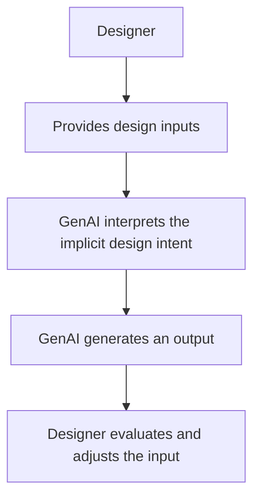
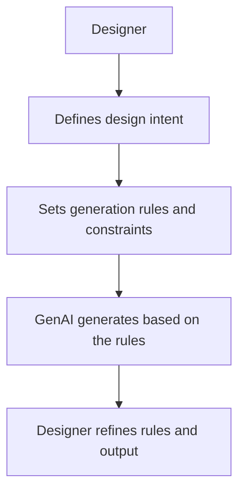

# 毕业设计中期 Proposal

## 1. 研究背景

随着生成式 AI 技术的发展，AI 在设计产物生成中的质量持续提升。设计师不再仅依赖 AI 进行早期创意探索和流程优化，而是在具体设计任务中与 AI 建立协作关系，使 AI 能够直接参与并辅助生成最终设计产物。
在这一转变中，“如何让 AI 理解并执行设计师的真实意图”成为关键瓶颈：当意图主要以自然语言 Prompt 的形式被隐式表达时，模型往往只能在不确定的语义空间中做推断，导致协作过程依赖反复试错与多轮修正。

## 2. 用户是谁？

### 2.1 设计师本人

- **设计经验**：信息设计经验丰富
- **AI 经验**：有丰富 AI 工具使用经验，广泛使用大模型、AI 辅助设计工具、AI Coding 工具，用于设计工作流优化与设计内容辅助产出
- **协作习惯**：倾向于利用 AI 进行初稿生成、创意启发、最终产物输出；在将设计意图转化为 AI 生成规则方面有经验，并与 AI 保持协作共创关系

### 2.2 用户需求

- **高效**：减少反复试错与修改成本
- **高质量**：生成结果稳定、符合预期意图、可用于实际设计任务推进

## 3. 场景是什么？

设计师在 AI 协作下，输出信息类设计产物（**Visual Communication Artifact**）。

### 3.1 场景特征

- **内容（Content）**：有明确的信息需要表达，信息传达为核心目标
- **结构（Structure）**：信息存在组织方式、层级关系与逻辑关系
- **视觉风格（Visual Style）**：体现设计调性、审美风格与视觉呈现
- **交互特征**：弱交互，重静态

### 3.2 典型正例（5 种最常见）

- 信息图（Infographic）
- 海报（Poster）
- 演示幻灯片（PPT Slide）
- 社媒视觉物料（Social Media Graphics）
- 宣传物料（Marketing Collateral）

### 3.3 反例

- UI 设计（User Interface Design）
- 视觉插画（Illustration Design）
- 品牌设计（Brand Identity Design）

## 4. 问题是什么？

然而，当前协作模式仍存在**设计意图难以清晰定义并有效传达**的问题，导致 AI 对设计师需求产生理解偏差，协作过程需要反复试错与修改，效率较低，生成结果也难以稳定符合设计师预期。

更具体地，信息类设计中的“设计意图”往往不是单一维度的审美偏好，而是由多个层面共同构成：

- **目标（Goal）**：受众是谁、要达成什么传播效果、要引导的行动是什么
- **内容（Content）**：信息要点、字段与数据、删减取舍与优先级
- **结构（Structure）**：信息层级、分组逻辑、阅读路径与叙事关系
- **形式（Form）**：版式节奏、布局倾向、可视化类型与呈现手法
- **流程（Process）**：内容/结构/视觉的先后顺序与迭代策略（非线性推进）
- **分工（Division of Labor）**：哪些环节由人主导、哪些由 AI 主导，以及介入比例

当这些要素只能被压缩为一段自然语言输入时，表达会不可避免地出现“模糊、遗漏、冲突、难复现”的问题：模型只能推断隐含意图，难以保持结构稳定与风格延续，设计师则通过反复改写 Prompt、反复抽卡与手动修补来补偿，从而造成效率低下与质量不稳定。

## 5. 解法是什么？

本研究拟引入**元设计（Meta-design）理论**，重新定义设计师与生成式 AI 的角色分工、协作模式与交互流程。

元设计的价值在于：设计师不只是提交一次性需求，而是把“生成设计产物所依赖的条件、规则、过程与分工”显式化为可编辑、可复用、可追溯的资产，使 AI 在更明确的生成框架下参与设计产出。

### 5.1 Before：Existing GenAI Workflow

### 5.2 After：Meta-design-driven GenAI

## 6. 研究问题

**核心研究问题：**\
如何基于元设计理论，重构设计师与生成式 AI 的协作模式，提升设计师在信息设计场景下的意图表达能力和交互体验，并最终提高生成内容的质量与效率？

### RQ1

基于元设计理论，设计师与生成式 AI 在信息设计场景中应形成怎样的角色分工与协作模式？

### RQ2

在信息设计场景下，设计师需要定义哪些体现设计意图的元设计内容？这些内容如何指导最终生成结果？

### RQ3

面向生成式信息设计系统，应构建哪些交互方式与流程，以支持设计师与生成式 AI 的高效协作？

## 7. 研究内容与方法

研究内容与方法对应以上三个研究问题展开：

### 7.1 基于元设计理论的设计师—生成式 AI 在信息设计场景下的协作模式研究

- **研究方法**：文献研究、RtD（Research through Design）、用户深访

### 7.2 信息设计场景下设计意图元设计内容构建与生成规则映射研究

- **研究方法**：工具案例研究、RtD、用户深访

### 7.3 面向生成式信息设计系统的设计师与生成式 AI 交互机制研究

- **研究方法**：原型构建与迭代、一对一参与式工作坊

## Q\&A

### 1. 为什么要研究信息类设计产物？

- **需求大**：信息设计产物是设计师日常最常见的任务类型，现实价值突出
- **GenAI 适配性**：传统 AIGC 在该场景下存在难编辑、语义失真、反复修改等问题；相比之下，更适合采用 GenAI 的结构化生成与协作编辑思路

### 2. 为什么“意图表达”在信息类设计场景是一个大痛点？

 

### 3. 随着模型能力进化，这个课题是否仍然有价值？

- **设计意图表达仍是瓶颈**：即使模型能力增强，设计师如何准确表达意图仍是关键问题
- **课题核心不在单一模型能力，而在人机协作机制**：本课题本质上研究的是人与生成式 AI 的协作模式和交互方式

