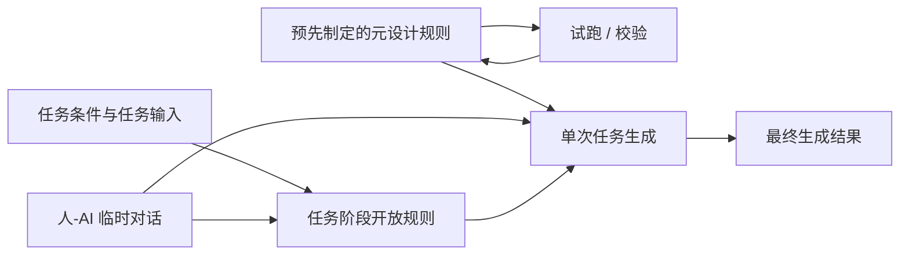

# RQ2 讨论稿：信息设计场景中的元设计空间与可制定规则（收敛版）

## 结论先行

### 当前结论

1. RQ2 关注的重点不是“设计师如何表达某次任务里的想法”，而是：在信息设计场景下，具体任务之外，设计师可以预先制定怎样的元设计空间。
2. 最终生成结果主要受两部分共同影响：`预先制定的元设计规则` 与 `任务阶段开放规则`。
3. 在规则系统之外，还需要一个 `人-AI 临时对话层`，用于围绕当前任务即时生成草案、候选规则、局部内容或结构建议。
4. 当前最核心的规则空间可收敛为三类：`内容规则`、`结构规则`、`视觉规则`；同时还需要补充一类连接三层的 `跨层映射规则`。
5. `约束` 与 `分工` 不单独作为规则空间，而是横向作用于以上三层及跨层映射规则的通用维度。
6. 规则不需要细到穷尽所有几何细节。更合理的分工是：`人定义高层和中层规则，AI 与系统负责底层展开与实现`。

### RQ2 当前表述建议

**RQ2：在信息设计场景下，具体任务之外，设计师可以制定怎样的元设计空间？**

## 总体模型

当前判断是：最终结果不是只由一套固定规则决定，而是由 `稳定底盘`、`任务阶段可变规则` 与 `人-AI 临时共创` 共同作用产生。
同时，预先制定的元设计规则并不是一次写完就结束，而是需要经过 `试跑 - 校验 - 回改` 的闭环验证。

## 一、核心规则空间

| 规则空间 | 核心问题 | 主要定义内容 | 对结果的作用 | 更适合的界面形式 |
| --- | --- | --- | --- | --- |
| 内容规则 | 需要生成哪些对象？这些对象分别是什么类型、表达什么语义、承担什么角色？ | 信息点、对象类型、对象语义、对象角色、优先级、事实边界 | 决定“生成什么” | 表单、对象卡片、类型/语义/角色标记 |
| 结构规则 | 这些对象如何组成模块，模块如何组成整体？ | 模块划分、层级关系、区域分布、对象位置、对象关系 | 决定“如何组织” | 画布、分区图、模块编排、连线关系图 |
| 视觉规则 | 已有结构应以什么视觉语言呈现？ | 字体、色彩、强调、图形风格、容器、密度 | 决定“如何被看见” | 样式面板、token、预设、局部覆写 |
| 跨层映射规则 | 什么内容形态更适合什么结构与视觉表达？ | 内容形态与版式匹配、对象组合与模块匹配、结构关系与视觉策略匹配 | 决定“哪些内容应落到哪些结构与视觉方案上” | 映射卡片、规则表、推荐关系、版式建议器 |

## 二、约束与分工作为横向维度

`约束` 与 `分工` 不与核心规则空间并列，而是横向作用于内容、结构、视觉与跨层映射四层。

| 横向维度 | 作用到哪里 | 示例 | 影响方式 |
| --- | --- | --- | --- |
| 约束 | 内容、结构、视觉、跨层映射 | 字数上限、平台尺寸、可访问性对比度 | 决定结果不能越过什么边界 |
| 分工 | 内容、结构、视觉、跨层映射 | 哪些内容必须人工确认、哪些结构可由 AI 提案、哪些视觉调整可自动执行 | 决定不同层上的协作权限边界 |

### 交付平台规格需要前置

当前还应补上一个更明确的判断：`平台规格` 不只是附属约束，而是很多信息设计任务中的前置条件。

例如：

- 平台比例会直接影响模块结构
- 渠道发布机制会影响标题长度、封面策略与信息密度
- 截图或图像的可读范围会反过来限制视觉表达

因此，在系统层面，平台规格虽然仍可归入 `约束`，但在界面与流程上应被前置到 `任务目标与场景` 中显式配置，而不是等到生成后再补救。

## 三、内容规则的核心：类型、语义、角色

内容规则不只是“写什么”，还包括对象的三层定义：

| 层次 | 回答的问题 | 例子 |
| --- | --- | --- |
| 对象类型 | 它是什么类型的对象？ | text、number、chart、table、icon、image、illustration、logo、shape/container、button/control、tag/badge、connector/arrow、map、qrcode、media |
| 对象语义 | 它表达什么意义？ | delete、warning、growth、time、comparison |
| 对象角色 | 它在当前设计里起什么作用？ | 标题、结论、证据、CTA、危险操作入口 |

一句话区分：

- `对象语义`：它表示什么
- `对象角色`：它在这里用来干什么

### 信息设计中的常见对象类型

| 对象类型 | 说明 | 例子 |
| --- | --- | --- |
| `text` | 文字对象 | 标题、正文、注释、来源、CTA 文案 |
| `number` | 数值对象 | KPI 数字、百分比、排名、时间数值 |
| `chart` | 图表对象 | 柱状图、折线图、饼图、散点图、雷达图 |
| `table` | 表格对象 | 对比表、参数表、时间表、名录表 |
| `icon` | 图标对象 | delete、download、share、warning |
| `image` | 图片对象 | 照片、截图、产品图、活动图 |
| `illustration` | 插画/示意对象 | 概念插图、流程示意、抽象配图 |
| `logo` | 标识对象 | 品牌 logo、机构 logo、项目标识 |
| `shape/container` | 形状或容器对象 | 卡片、边框、底板、标签底、分组区块 |
| `button/control` | 按钮或控件对象 | 操作按钮、切换器、分页控件、导航按钮 |
| `tag/badge` | 标签对象 | 分类标签、状态 badge、编号标记 |
| `connector/arrow` | 连接对象 | 流程连线、箭头、关系线、分支线 |
| `map` | 地图对象 | 区域分布图、路径图、地理定位图 |
| `qrcode` | 机器识别对象 | 二维码、小程序码、跳转码 |
| `media` | 媒体对象 | 视频封面、音频卡片、动画占位 |

## 四、结构规则的重点：最适合可视化表达

当前可以明确一个判断：在四类规则里，`结构规则最适合通过可视化方式进行定义与展示`。

| 结构层级 | 定义内容 | 更适合的可视化形式 |
| --- | --- | --- |
| 整体结构 | 页面骨架、主次区域、阅读路径 | 区块分区图、整体布局图 |
| 模块结构 | 模块顺序、模块关系、模块内部对象组成 | 模块编排图、层级树 |
| 对象结构 | 对象在模块中的位置、对齐、间距、邻接与连接关系 | 画布布局图、连线关系图 |

这意味着结构规则在界面上更像 `画布`，而不是纯 `表单`。

## 四点五、跨层映射规则：经验真正高频复用的部分

如果说内容规则、结构规则、视觉规则分别定义了三个层面，
那么在真实设计实践中，还有一类极其重要的规则，负责把三层连接起来。

这类规则更接近设计师的经验判断，例如：

- 什么内容适合做成数据结构，什么内容更适合做成论点结构
- 什么对象组合一出现，就应该优先匹配某类模块
- 什么结构关系更适合高强调视觉，什么结构关系更适合低干预呈现

这类规则不属于纯内容、纯结构或纯视觉中的任何一层，
而更像是 `内容 -> 结构 -> 视觉` 之间的映射机制。

因此，RQ2 如果只停留在三层分类，仍然不足以完整表达真实元设计经验；
还需要承认并支持这类 `跨层映射规则`。

## 五、视觉规则如何被 AI 读懂

视觉规则不能停留在“现代、轻盈、高级感”这类风格描述，而需要被转写成结构化信息。

### 视觉规则的基本结构

`作用对象 + 视觉维度 + 规则值 + 作用范围 + 例外条件 + 优先级`

| 视觉维度 | AI 需要读懂的信息 | 结构化表达例子 | 值的开放方式 |
| --- | --- | --- | --- |
| 字体 | 对谁生效；字号、字重、行距怎么设定 | 标题 `700 / 28-32px`；正文 `400 / 14-16px` | 固定、范围可调、任务决定 |
| 色彩 | 哪些对象可用什么颜色；是否受语义影响 | delete icon 使用危险红；正文禁用高饱和强调色 | 固定、候选值、条件触发、任务决定 |
| 强调 | 什么对象可以被突出；如何突出 | 关键数据可高对比；正文不得多重强调 | 固定、可选、条件触发 |
| 图形风格 | 图标、图表、插图采用什么一致风格 | 统一线性图标；描边 `1.5px`；不使用填充 | 固定、范围可调、AI 推导 |
| 容器与密度 | 卡片层次、留白、间距如何定义 | 重点卡片高对比底色；模块间距 `16px` | 固定、可选、范围可调、任务决定 |

### 规则项与规则值

真正需要被元设计的，往往不是把每个值预先写死，而是：

1. 哪些 `规则项` 需要被控制
2. 这些 `规则值` 允许如何变化
3. 这些值在何时、由谁确定

| 层次 | 含义 | 例子 |
| --- | --- | --- |
| 规则项 | 要控制什么 | 标题颜色、图标描边、模块密度 |
| 规则值 | 这次具体取什么值 | `#1F3A5F`、`1.5px`、`16px` |
| 值的开放方式 | 值是固定、可选、范围可调还是任务决定 | 品牌字体固定；强调色任务决定；字号在范围内浮动 |

## 六、规则作用范围：全局、模块级、对象级

| 层级 | 含义 | 例子 |
| --- | --- | --- |
| 全局规则 | 对整个任务或整个产物生效 | 全部页面统一品牌字体；整体采用时间线结构 |
| 模块级规则 | 只对某个模块或区块生效 | 结论模块高强调；案例模块必须带来源 |
| 对象级规则 | 只对某个具体对象生效 | 某个标题可改写；某个 icon 必须是 delete；某个图表单独高亮 |

规则关系通常不是二选一，而是：

`全局规则提供底盘，模块级和对象级规则做有限覆写。`

## 七、分工作为横向协作权限维度

分工的本质，不是规定“谁做哪一步”，
而是规定在人机协作中，针对内容、结构、视觉等不同层上的对象，谁拥有定义、生成、修改和确认的权限。

可以把它压缩成三个关键词：

- `对象层级`：对什么东西分工
- `权限类型`：分的是什么权
- `责任主体`：这个权归谁

| 维度 | 需要回答的问题 | 例子 |
| --- | --- | --- |
| 对象层级 | 这个分工发生在哪一层？ | 整体任务、模块、对象 |
| 权限类型 | 分的是哪一种权？ | 定义权、生成权、修改权、确认权、自动执行权 |
| 责任主体 | 这个权由谁拥有？ | 人、AI、人机协作、AI 先建议后人确认 |

| 层级 | 定义权 | 生成权 | 修改权 | 确认权 |
| --- | --- | --- | --- | --- |
| 整体任务 | 人 | AI 可建议 | 人 | 人 |
| 模块 | 人 / AI 协作 | AI | 人 / AI | 人 |
| 对象 | 人可指定 | AI 可执行 | AI 可微调 | 关键对象由人确认 |

## 八、规则颗粒度分层

元设计规则不适合细到穷尽所有几何细节。更合理的做法是分层：

| 颗粒度层级 | 主要定义什么 | 更适合由谁决定 | 例子 |
| --- | --- | --- | --- |
| 高层规则 | 任务目标、表达类型、主要模块、整体结构方向 | 人 | 这是流程图还是对比图；必须有结论模块 |
| 中层规则 | 对象类型/语义/角色、模块关系、视觉规则项、局部优先级 | 人主导，AI 可辅助 | delete icon 属于危险操作对象；A 节点连接 B 节点 |
| 底层规则 | 精确位置、连线走向、避让方式、像素级间距、局部微调 | AI 主导，且可预先写入系统 | 箭头如何拐弯，图标离文字多远，卡片间距是 14px 还是 16px |

这也是 GenUI 更适合介入的位置：

- `人` 定义高层和中层规则
- `AI` 展开底层实现
- `系统` 可内置一部分高频、稳定、低层的默认规则

## 九、任务变量与规则系统的边界

并不是所有影响生成结果的因素都应该被定义为“长期规则”。

| 类型 | 含义 | 是否应长期保存 | 例子 |
| --- | --- | --- | --- |
| 预先制定的规则 | 长期稳定、可复用的机制设定 | 是 | 内容骨架、结构模板、品牌字体、默认分工 |
| 任务阶段开放规则 | 在本次任务内形成的临时规则 | 可选 | 本次强调结论优先；本次活动页提高强调强度 |
| 任务输入 | 本次任务特有的目标、材料、场景与语境 | 不一定 | 受众、平台、原始内容、活动主题、时间限制 |

## 十、人与 AI 的临时对话层

除了规则配置外，原型中还应保留一个 `人-AI 临时对话板块`。
它的作用不是替代规则系统，而是作为任务进行中的即时共创通道，帮助用户快速得到草案、候选方案和规则思路。

| 对话层作用 | 说明 | 例子 |
| --- | --- | --- |
| 产出草案 | 快速生成局部内容或界面候选 | 先生成一个 delete icon 草案，或一个结论模块文案草稿 |
| 规则建议 | 帮助用户提出可能的规则项 | AI 建议“这个模块需要高强调”或“这里应标记为 CTA” |
| 结构探索 | 在规则未定前先试探不同组织方式 | 让 AI 提出 3 种流程图结构或 2 种模块布局 |
| 局部修补 | 针对具体对象做即时微调 | 让 AI 重写一段说明、替换一个 icon、强化一个结论块 |
| 规则沉淀 | 把对话中形成的稳定想法转成规则 | 将“这类活动页都用高对比结论区”保存为模块级规则 |

### 这层与规则系统的关系

当前更合适的理解是：

- `规则系统` 负责保存、复用、约束和稳定机制
- `对话层` 负责探索、试探、草拟和临时共创

因此，对话层中产生的内容不一定直接成为长期规则，但应允许用户把有价值的结果继续沉淀为：

1. 任务级临时规则
2. 模块级或对象级规则
3. 可长期复用的系统规则

当前判断再补充一点：对话结果如果需要升级为规则，不应默认自动进入规则系统，
而应由用户自行决定并手动添加进规则中。

## 十一、元设计阶段要先定义什么，开放什么

在元设计阶段，设计师不需要预先规定每一次任务的具体结果，
而是需要先决定：`哪些规则应作为稳定底盘被预先制定，哪些规则应开放给具体任务再决定。`

这里的关键不是把所有规则都写死，
而是为后续任务划定一个“可控但可变”的边界。

### 元设计阶段更适合先定义的内容

这些内容通常具有 `稳定性`、`复用性` 和 `高影响性`，
适合作为长期规则沉淀下来。

| 更适合在元设计阶段定义 | 原因 | 例子 |
| --- | --- | --- |
| 常见对象类型与角色集合 | 多任务复用，决定系统能识别什么 | text、icon、chart；标题、结论、CTA、证据 |
| 结构模板与模块骨架 | 是信息设计的高层组织逻辑 | “标题 + 图表 + 结论”模板；“问题-分析-结论”骨架 |
| 基础视觉规则项 | 决定整体一致性，但不必写死所有值 | 字体系统、色彩体系、强调机制、图标风格 |
| 分工默认机制 | 决定系统中人和 AI 的基本协作方式 | 核心文案必须人工确认；AI 可生成对象草案 |
| 横向约束 | 保证结果不会越界 | 品牌规范、平台限制、可访问性要求 |
| 底层默认逻辑 | 高频且稳定，适合内置为系统能力 | 自动对齐、连线避让、小尺寸图标加粗 |

### 更适合开放给任务阶段的内容

这些内容通常随任务变化更快，或者需要结合具体语境临时决定。

| 更适合开放给任务阶段 | 原因 | 例子 |
| --- | --- | --- |
| 任务目标与优先级 | 强依赖本次任务 | 更强调转化、说明、汇报还是总结 |
| 内容重点 | 不同任务关注点不同 | 这次突出结论，还是突出过程与证据 |
| 局部结构选择 | 同一模板下也可能有不同变体 | 本次是时间线还是对比结构 |
| 视觉规则值 | 规则项可以稳定，但值常随任务变化 | 本次强调色、密度强度、局部视觉语气 |
| 分工深度 | 不同任务对 AI 参与程度不同 | 本次只让 AI 补文案，还是允许其提结构方案 |
| 局部例外 | 常是任务临时需求 | 某个模块单独高亮、某个对象允许特殊样式 |

同时，任务阶段并不一定只能在既有边界内执行。
在真实任务中，用户仍然可以回过头去改动元设计层的内容，
也就是说，任务阶段与元设计阶段之间应允许双向往返，而不是单向下发。

### 一个更直接的判断标准

如果某项内容满足以下特征，就更适合在元设计阶段预先定义：

- 会跨任务重复出现
- 一旦不定义，结果很容易跑偏
- 定义后能明显提高一致性和复用性

如果某项内容满足以下特征，就更适合开放给任务阶段：

- 强依赖本次目标、受众、场景或材料
- 变化频率高
- 更像“这次怎么做”而不是“系统通常怎么做”

### 对原型设计的直接启发

这意味着系统不应只有一个统一的规则面板，
而应区分至少两层入口：

| 层级 | 主要作用 | 界面上的可能形态 |
| --- | --- | --- |
| 元设计层 | 定义长期规则、模板、默认机制与开放边界 | 规则库、模板库、默认权限配置、系统约束面板 |
| 任务层 | 在给定边界内配置本次任务的可变规则 | 任务面板、局部覆写、任务对话区、候选方案区 |

### 外部资源里还应区分一类：可执行的元设计包

除了普通参考资源外，当前还应识别一类更强的外部化规则载体：

- `skill`
- `template`
- `preset`
- `layout recipe`
- `checklist`

这类内容与一般参考图或风格库不同，
它们往往已经把设计经验封装成了可直接调用的机制，
例如默认模板、版式映射、平台适配规则和检查逻辑。

因此，在后续原型里，这类内容更适合被理解为：

- 外部化规则包
- 可执行的元设计包

而不只是普通素材引用。

### 元设计阶段还需要测试环节

预先制定元设计规则时，不能只停留在“把规则写出来”，
还需要有一个 `测试 - 观察 - 回改` 的环节，
去验证生成结果是否真的会按照这些规则运行。

换句话说，元设计阶段不只是配置规则，
还包括对规则可执行性与结果稳定性的校验。

| 测试环节要看什么 | 要回答的问题 | 例子 |
| --- | --- | --- |
| 结果一致性 | 同类任务下结果是否保持一致 | 相同模板下多次试跑是否仍保持模块骨架一致 |
| 规则生效率 | 生成结果有没有遵守已定义规则 | delete icon 是否真的按指定语义和角色生成 |
| 缺失规则诊断 | 哪些关键规则没定义，导致结果跑偏 | 流程图节点定义了，但连线关系没定义清楚 |

### 这对原型意味着什么

因此原型里除了“规则配置区”，最好还要有一个面向元设计阶段的 `试跑 / 预览 / 校验区`。

| 原型中的功能 | 作用 | 例子 |
| --- | --- | --- |
| 试跑生成 | 根据当前规则快速出一个结果 | 用同一套规则生成一页示例 PPT |
| 对照预览 | 对比规则与结果是否一致 | 看结论模块是否真的出现在右下角 |
| 规则诊断 | 提示哪些规则没生效、冲突或不完整 | 提醒“对象角色已定义，但结构关系缺失” |
| 快速回改 | 发现问题后立即修改规则并再次试跑 | 调整模块优先级后重新生成 |

## 十二、元设计阶段与真实任务阶段的人-Agent协作模式

当前可以把协作模式抽象成两个阶段：

1. `元设计阶段`
人和 Agent 共同设计“协作机制本身”。

2. `真实任务阶段`
人和 Agent 在既有机制中完成具体任务产出。

两者的区别不只是任务内容不同，更在于：`人和 Agent 的角色重心不同。`

| 维度 | 元设计阶段 | 真实任务阶段 |
| --- | --- | --- |
| 核心目标 | 设计规则、模板、默认机制与开放边界 | 在规则框架内完成具体设计任务 |
| 人的主要角色 | 机制设计者、规则制定者、校验者 | 任务发起者、判断者、关键确认者 |
| Agent 的主要角色 | 规则建议者、试跑执行者、规则诊断者 | 草案生成者、局部优化者、执行协作者 |
| 主要产出 | 规则库、模板、默认分工、约束、测试结果 | 具体页面、模块、图表、文案、图标、变体方案 |
| 协作重点 | “这套机制该如何工作？” | “在这套机制里，这次任务该如何完成？” |

### 元设计阶段的人-Agent协作模式

在元设计阶段，人的主导性更强。
人负责定义高层目标和关键规则，Agent 负责帮助补全、试跑和诊断。

| 主体 | 主要职责 |
| --- | --- |
| 人 | 确定规则空间、开放边界、默认分工、模板骨架、关键约束 |
| Agent | 提出候选规则、补全规则项、执行试跑生成、指出规则冲突和缺失 |

这一阶段更像：

`人定义机制 -> Agent 试跑 -> 人校验 -> 人回改 -> 形成稳定规则`

### 真实任务阶段的人-Agent协作模式

在真实任务阶段，规则系统已经存在，
人的重点从“设计机制”转向“完成当前任务”，Agent 的重点则从“诊断规则”转向“执行与共创”。

| 主体 | 主要职责 |
| --- | --- |
| 人 | 提供任务目标、选择任务变量、决定是否接受建议、处理关键确认 |
| Agent | 根据规则生成草案、补全文案、提出结构候选、展开视觉结果、执行局部修改 |

这一阶段更像：

`人给出任务 -> Agent 生成候选 -> 人选择/修正 -> Agent 继续展开 -> 人确认结果`

### 两阶段之间的关系

这两个阶段不是割裂的，而是一个循环：

- 元设计阶段产生稳定规则与模板
- 真实任务阶段在其中执行具体任务
- 任务中的问题、例外与新做法又可以回流到元设计阶段
- 最终更新规则系统

也就是说，系统不是一次性配置完就结束，
而是在 `机制设计` 与 `任务执行` 之间持续往返迭代。

## 十三、对后续界面设计的直接启发

| 规则类型 | 更适合的界面表达 |
| --- | --- |
| 内容规则 | 表单 + 对象卡片 + 类型/语义/角色标记 |
| 结构规则 | 画布 + 分区图 + 模块编排 + 连线关系图 |
| 视觉规则 | 样式面板 + token + 预设 + 局部覆写 |
| 分工维度 | 权限设置 + 任务分派 + 审批机制 |
| 临时对话层 | 聊天面板 + 候选结果区 + “保存为规则”入口 |

## 暂定总括

RQ2 当前最核心的结论是：在信息设计场景中，适合被元设计化的不是所有细节，而是那些 `高影响、高歧义、可复用` 的规则。对系统而言，更合理的做法不是要求用户定义全部低层细节，而是支持设计师显式制定高层与中层规则，再由 AI 与系统展开底层实现。
