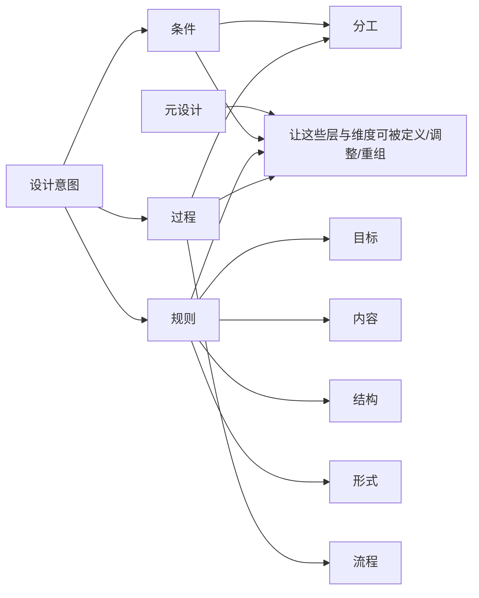

# 设计意图与元设计映射

## 一句话定义

`设计意图 = 设计师对设计结果规则 + 协作过程规则的定义`

## 1. 设计意图是什么

| 抽象层 | 含义 |
| --- | --- |
| 条件 | 谁能参与定义、能定义什么、在什么前提下协作发生 |
| 规则 | 设计结果与协作方式需要遵循什么要求 |
| 过程 | 这些要求如何按步骤展开与调整 |

| 具体维度 | 归属 | 设计师在定义什么 |
| --- | --- |
| 目标 | 规则 | 为什么做、想让用户如何理解这份信息 |
| 内容 | 规则 | 哪些信息保留、删减、强调 |
| 结构 | 规则 | 信息顺序、层级、图文组织方式 |
| 形式 | 规则 | 版式、风格、媒介适配等要求 |
| 流程 | 过程 | 先做什么后做什么，哪里发散哪里收敛 |
| 分工 | 条件 / 过程 | 人和 AI 各做什么，谁在什么时候介入 |

## 2. 设计意图与元设计的关系

| 概念 | 回答的问题 | 在本课题中的意思 |
| --- | --- | --- |
| 设计意图 | 设计师想定义什么 | 结果规则 + 过程规则 |
| 元设计 | 设计师如何有能力去定义 | 让规则与过程可被设计师主动设定、修改、重组 |



## 3. 本课题中元设计对应什么

| 抽象层 | 维度 | 体现内容 |
| --- | --- |
| 条件 | 分工 | 谁主导、谁执行、谁判断、谁能修改 |
| 规则 | 目标 | 传播目的、理解重点、表达优先级 |
| 规则 | 内容 | 信息取舍、内容约束、重点强调 |
| 规则 | 结构 | 顺序安排、层级划分、组织逻辑 |
| 规则 | 形式 | 视觉表达、版式要求、媒介适配 |
| 过程 | 流程 | 协作步骤、生成顺序、调整方式 |
| 过程 | 分工 | 人在何时介入，AI 在何步参与 |

## 4. 与固定 Skill 的区别

| 固定 Skill | 本课题 |
| --- | --- |
| 预设 workflow | 设计师可定义 workflow |
| 复用既有流程 | 主动修改与重组流程 |
| 规则多由系统预先写定 | 规则可由设计师输入与调整 |

## 5. 核心落点

```text
不是直接要一个结果
而是先定义条件、规则、过程
并在其中细化目标、内容、结构、形式、流程、分工
再让 AI 在其中协作生成
```
